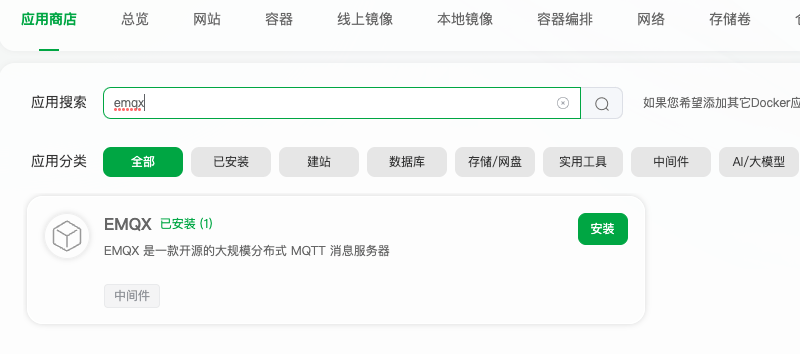

# 介绍

Mqtt，模块是基于[simps/mqtt](https://github.com/simps/mqtt) 封装的模块，结合 https://www.emqx.com/zh 使用

# 安装

```shell
php bin/hyperf.php hcms:install mqtt
```

### composer 依赖

```shell
composer require "simps/mqtt"
```

# 配置

.env 配置

```dotenv
MQTT_HOST=127.0.0.1
MQTT_PORT=1883
MQTT_CLIENT_ID=php-mqtt
MQTT_USERNAME=
MQTT_PASSWORD=
```

# emqx

宝塔


# MqttProcess

## process.php 配置

```php 
return [
    \App\Application\Mqtt\Process\MqttProcess::class,
];
```

## 订阅

```php
$client = $this->mqttService->getClient("MqttProcess-" . time());
//TODO 根据业务需求订阅topics
$topics = [
    "simps-mqtt/user/post/+" => MQTT_QOS_1,
    "simps-mqtt/user/get/+" => MQTT_QOS_1
  ];
```

## 客户端调用

```php
$client = $this->mqttService->getClient("MqttProcess-" . time());
$client->publish("simps-mqtt/user/post/123", "hello world");
```
